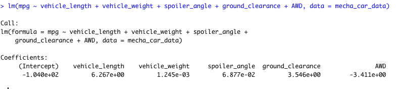
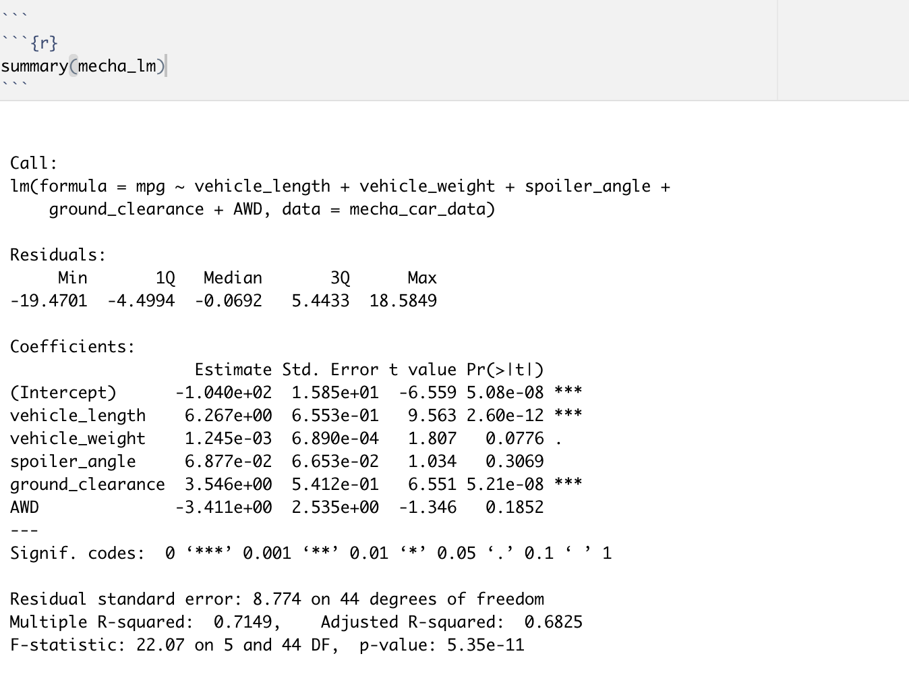
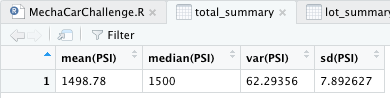
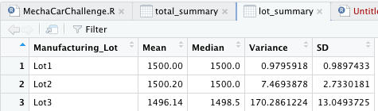
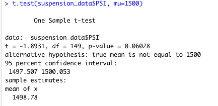
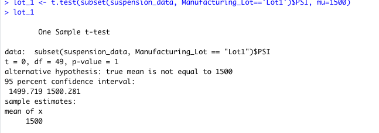
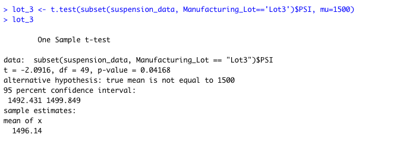

# MechaCar_Statistical_Analysis

# Deliverable 1 :

## Linear Regression to Predict MPG

### 1. Which variables/coefficients provided a non-random amount of variance to the mpg values in the dataset?

Intercept, vehicle length and ground clearance provide non-random amount of variance to the mpg values in the dataset. Their Pr(>|t|) values are of significance code 0.
- Intercept : 5.08-08
- Vehicle length : 2.60e-12
- Ground clearance : 5.21e-08

### 2. Is the slope of the linear model considered to be zero? Why or why not?
The slope of this linear model cannot be considered to be zero. The p-value is 5.35e-11. It is a smaller than the significance level of 0.05. It means that there is sufficient evident to reject null hypothesis and the slope of multiple linear regression model are not zero.

### 3. Does this linear model predict mpg of MechaCar prototypes effectively? Why or why not?
This linear regression model does help predict the relationship between mpg and other variables. The vehicle length and ground clearance does have significant correlation with mgp.

# Deliverable 2:

## Summary Statistics on Suspension Coils

MechaCar suspension coils dataset have mean and median 1498.78 and 1500 respectively. The values are normally distributed.

The Standard deviation of PSI is 7.89.

The Variance of the PSI distribution is 62.29. The value is less than 100 pounds per inch. The design specification for MechaCar suspension coils dictate that he variance of the suspension coils must not exceed 100 pounds per square inch. 62.29 is less than 100 and does meet the design specification for all manufacturing lots and each lot individually.

# Deliverable 3:

## T-Tests on Suspension Coils

By performing the T-Test on suspension coils we see that the p-value is 0.06. The value is greater than the significance level of 0.05. This indicates that there is not enough evidence to reject the null hypothesis. This means that the PSI result is statistically similar to the mean population of result of 1500 PSI.

### Lot_1 : 

P-value of Lot_1 is 1.  It is greater than the significance level of 0.05. This indicates that there is not enough evidence to reject the null hypothesis. This means that the PSI result is statistically similar to the mean population of result of 1500 PSI.

### Lot_2 : 

P-value of Lot_2 is 0.06. It is greater than the significance level of 0.05. This indicates that there is not enough evidence to reject the null hypothesis. This means that the PSI result is statistically similar to the mean population of result of 1500 PSI.

### Lot_3 : 

P-value of Lot_3 is 0.042. It is less than the significance level of 0.05. This indicates that there is enough evidence to reject the null hypothesis. This means that the PSI result is not statistically similar to the mean population of result of 1500 PSI.

# Deliverable 4 :

## Study Design: MechaCar vs Competition
